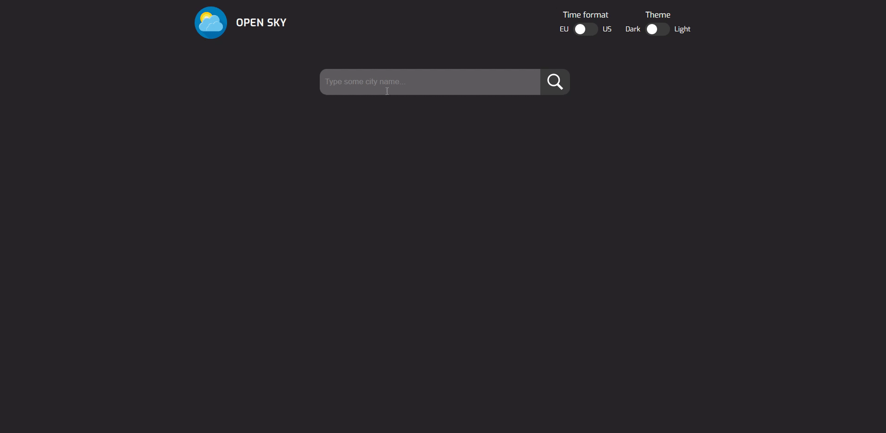

Weather app (openweathermap api) on React with Axios, RTK, Redux Thunk([Link to preview gif](#preview-of-the-project))

&nbsp;

<strong>Link to GitHub-Pages of this app:</strong>
<strong><a href="https://snapsterr.github.io/weather-react/">Weather app</a></strong>

&nbsp;

<strong>To start the project follow the next steps:</strong>

- 'npm install'
- 'npm i @reduxjs/toolkit'
- 'npm i redux-thunk'
- 'npm i react-dom'
- 'npm i node-sass'
- 'npm start'

<strong>Functionality of the Weather app:</strong>

- type the name of the city where you want to know the weather;
- switch between EU or US time format in the top right of the app;
- switch between light or dark theme in the top right of the app;
- switch between celsius or fahrenheit;
- select temperature or humidity inside forecast block.

&nbsp;

### Preview of the project

&nbsp;

